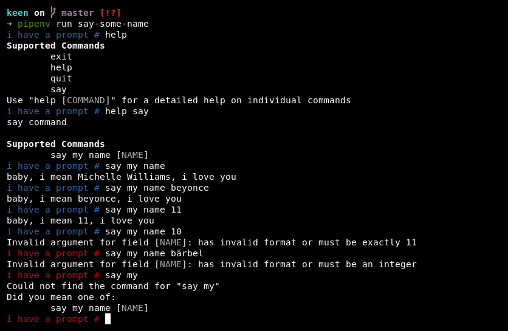

# 

kien is python3 library that allows you to create a custom line-based
command parser with the goal of creating shell-like interfaces. kien
is not a shell and doesn’t try to be.

If you want to provide an human and machine friendly text-based interface
on a serial device kien is for you. kien’s best-case scenario: you’re
just writing the code that actually does things.

Please note that kien is under active development and does not have a stable
API yet. Breaking changes will occur between minor versions as long as we
didn’t publish v1.0.0 but will be documented in the [changelog](./CHANGELOG.md).

kien has support for:

 * (optional) keywords 
 * variables
 * validation
 * transformation
 * auto-generated help and documentation
 * dependency-injection
 * human-readable and json output
 


## Examples

kien mostly works by annotating functions with decorators. See the examples folder 😊

```sh
# run examples with pipenv
pipenv run example examples/say-some-name.py

# or using your shell powers 
# (install dependencies first or initialize and load a virtualenv) 
PYTHONPATH=. python3 examples/say-some-name.py
```

## Work in progress

* There are currently no tests
  
  This is not because there shouldn’t be but because kien just
  recently has been extracted from an application that only 
  tests the actual commands that kien executes. In this
  sense there are tests that cover most of kien’s functionality
  but they simple are not public. That being said: kien
  should and will have tests in the future.

* Output formatting & Terminal handling

  The way kien handles the terminal and how it writes and formats
  text are hard-coded and in some need for careful thought and
  refactoring. 
  
* There is little documentation

## Say my name

kien is a pun and a homage to Commander Keen, because kien’s integral
part is called a *Commander*. kien also is a rather old way to refer
to a pine tree in german. There you go :)
